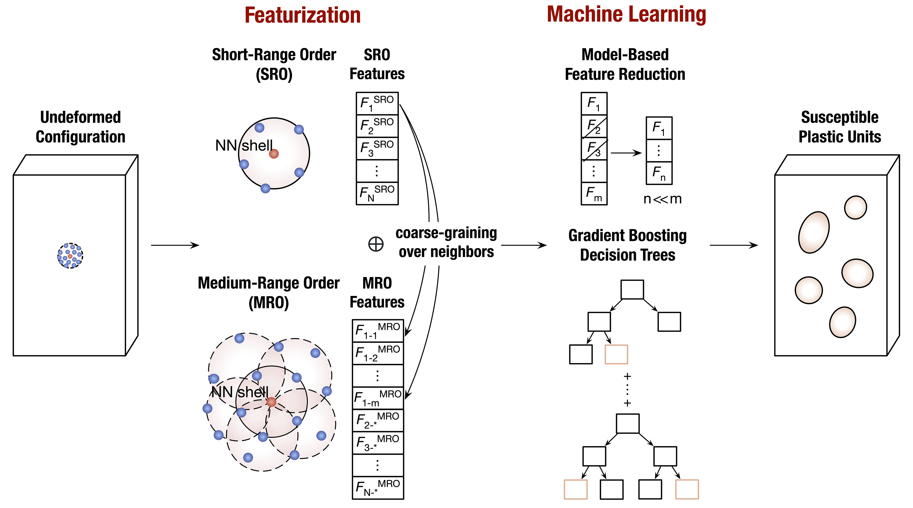

# amlearn
Machine Learning Package for Amorphous Materials (WIP).

To featurize the heterogeneous atom site environments in amorphous materials,
we can use amlearn to derive 1k+ candidate features that encompass short- (SRO)
and medium-range order (MRO) to describe the packing heterogeneity around each atom site. 
(See the following example figure for combining site features and machine learning (ML) to predict the 
deformation heterogeneity in metallic glasses). 

Candidate features include recognized signatures
such as coordination number (CN), Voronoi indices, characteristic motifs,
volume metrics (atomic/cluster packing efficiency), i-fold symmetry indices,
bond-orientational orders and symmetry functions (originally proposed to fit
ML interatomic potentials and recently gained success in featurizing disordered
materials). We also include our recently proposed highly interpretable and generalizable
distance/area/volume interstice distribution features in amlearn (see [A transferable machine-learning framework linking interstice distribution and plastic heterogeneity in metallic glasses](https://www.nature.com/articles/s41467-019-13511-9). Qi Wang and Anubhav Jain. Nature Communications 10, 5537 (2019)).

In amlearn, We integrate Fortran90
with Python (using f2py) to achieve combination of the flexibility and
fast-computation (>10x times faster than pure Python) of features.
Please refer to the SRO and MRO feature representations in `amlearn.featurize`. 
We also include an `IntersticeDistribution` class as a site featurizer in [matminer](https://github.com/hackingmaterials/matminer), a comprehensive Python library for ML in materials science. 


<div align='center'></div>   
&nbsp;       


## Installation

Before installing amlearn, please install numpy (version 1.7.0 or greater) first.

We recommend to use the conda install.

```sh
conda install numpy
```

or you can find numpy installation guide from [Numpy installation instructions](https://www.scipy.org/install.html).


Then, you can install amlearn. There are two ways to install amlearn:

**Install amlearn from PyPI (recommended):**

```sh
pip install amlearn
```


**Alternatively: install amlearn from the GitHub source:**

First, clone amlearn using `git`:

```sh
git clone https://github.com/Qi-max/amlearn
```

 Then, `cd` to the amlearn folder and run the `setup.py`:

```sh
cd amlearn
sudo python setup.py install
```

## References
Qi Wang and Anubhav Jain. A transferable machine-learning framework linking interstice distribution and plastic heterogeneity in metallic glasses. Nature Communications 10, 5537 (2019). doi:[10.1038/s41467-019-13511-9](https://www.nature.com/articles/s41467-019-13511-9)
